## 导出骨架  
-----  
1. 由模型制作软件(如3DMax)中导出带有游戏中会使用到的所有骨骼的fbx文件,fbx中可以带有一套方便查看错误的模型  
2. fbx导入配置  
  
3. 打开`ExportActorScenes\ExportSkeleton.unity`场景,创建骨架对应的prefab.  
    
4. Prefab的配置项  
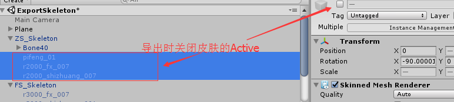    
5. 真正导出时的选项  

-----  
## 导出NPC
----- 
NPC的FBX模型文件存放的位置
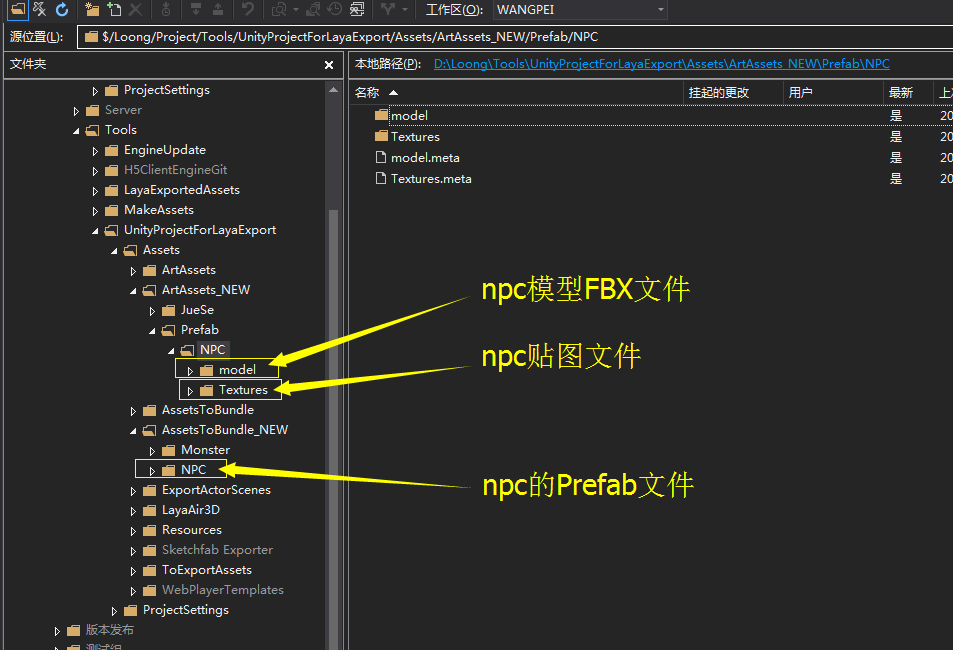

1. 添加FBX文件，贴图文件，修改FBX属性，修改材质球信息，贴好贴图。

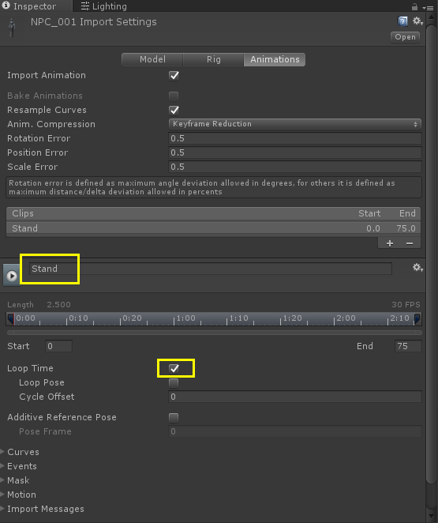
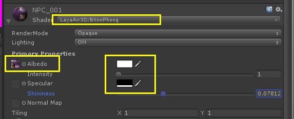

2. 右键添加Animator Controller 组件，添加角色的动画文件到组件，在prefab上加上制作完成的组件。
角色位置要放在0.0.0点，然后制作prefab。

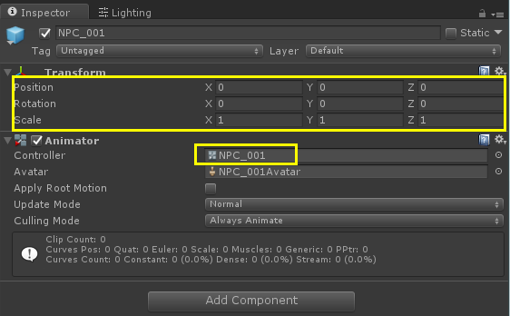
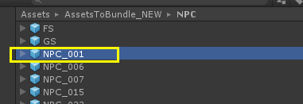

3.输出模型和动作文件。在场景内只留下需要输出的角色（其他的隐藏或删除）。

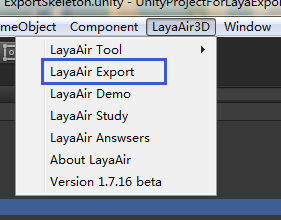
选择角色输出的选项（Character）,修改输出路径，点击输出
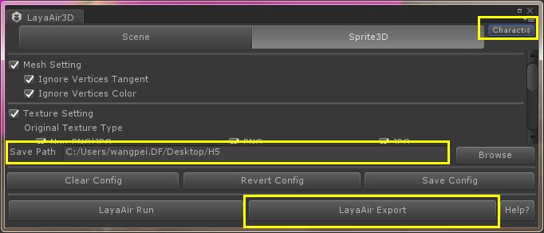

4.把输出文件放在相对应的H5文件夹内。Lh+模型+动作+材质+贴图文件。
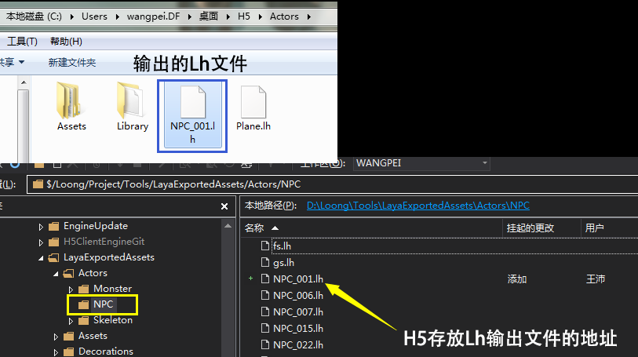
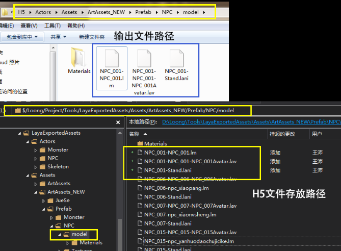
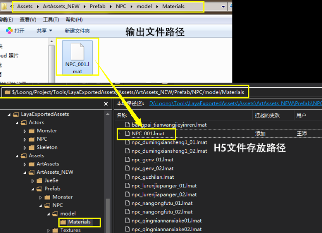

-----  
## 导出Monster怪物
----- 
怪物FBX模型文件存放位置

1.	添加FBX文件，贴图文件，修改FBX属性，修改材质球信息，贴好贴图。
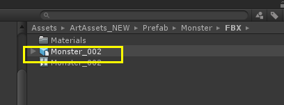

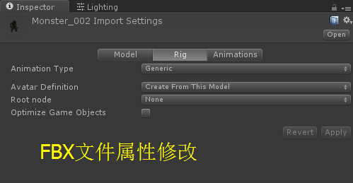
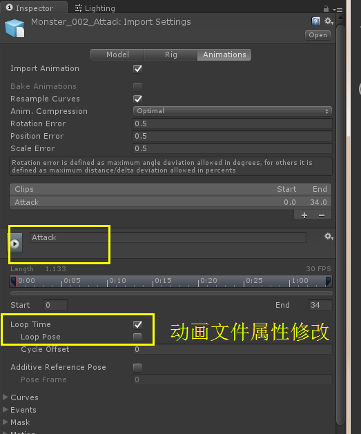
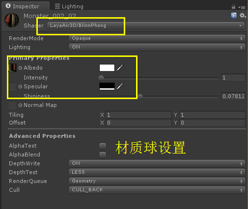

2. 右键添加Animator Controller（动画控制器） 组件，添加角色的动画文件到组件，在prefab上加上制作完成的组件。
角色位置要放在0.0.0点，然后制作prefab。

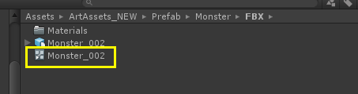

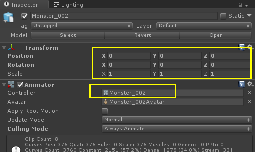

3.输出模型和动作文件。在场景内只留下需要输出的角色（其他的隐藏或删除）。
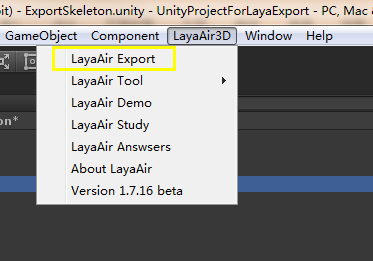
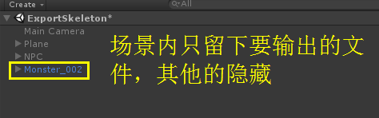

4.把输出文件放在相对应的H5文件夹内。Lh+模型+动作+材质+贴图文件。
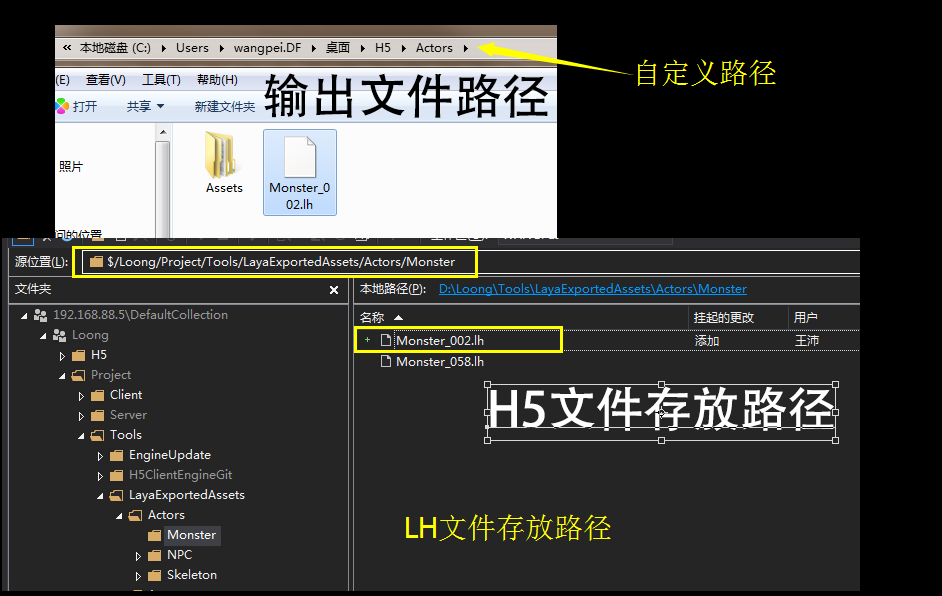
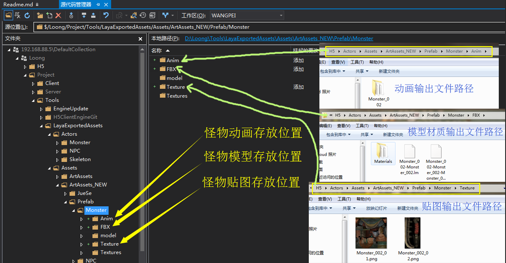
